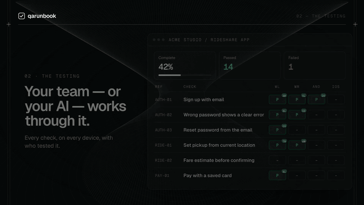

# qarunbook



**Work out what needs testing, then actually get it tested.**

Most teams know they should test before a release. What stops them is not
discipline — it is that nobody wants to sit down and write out three hundred
things to check, and once somebody has, there is nowhere sensible to record
what happened to each one.

qarunbook does both halves:

1. **Itemise.** Point an AI assistant at your codebase and it works out every
   module, feature and user journey worth testing, across each platform you
   ship on, and writes them as checks a non-technical person can follow. Or
   write them yourself, or upload a plan you already have.
2. **Test and track.** Testers work top to bottom, marking each check passed or
   failed and raising what breaks. You can see how far along the release is at
   any moment, and what is in the way.

It is built for **user acceptance testing** — the pass a human makes over a
real build before it ships. Not unit tests, not CI. The kind of testing where
somebody opens the app, signs up, and tries to actually use it.

**https://qarunbook.com** — free to use.

---

## Why an MCP server

Because the loop usually breaks at the hand-off. A tester finds a bug, writes
it in a spreadsheet or a WhatsApp message, and it is now somebody's job to read
that, understand it, fix it, and remember to tell the tester it is done.

qarunbook exposes the runbook over MCP, so your coding assistant is on the
other end of that loop directly:

```
list_issues            what did the testers actually find (and what they attached)
list_checks failing    what is broken right now
edit_issue             that report was vague — here is what actually happens
resolve_issue          I fixed it
```

Testers can attach screenshots, screen recordings and logs to an issue in the
web app. Videos stream straight in the page, so a bug is something you watch
rather than something you read about.

When an issue is marked fixed, the check does not silently go back to passing.
It reads **R — retest**, because the person who last passed it was looking at a
build without the fix in it. It clears when somebody actually looks again.
Status is derived from marks and issues rather than stored, so the runbook can
never quietly disagree with itself.

## Install

### Claude Code

One step, and the MCP connection and both skills come with it:

```text
/plugin marketplace add Ifeanyiejindu/qarunbook
/plugin install qarunbook@qarunbook
```

(or from a terminal: `claude plugin marketplace add Ifeanyiejindu/qarunbook` then
`claude plugin install qarunbook@qarunbook`)

Then set your token, from your qarunbook home page under **Connect your AI**:

```bash
export QARUNBOOK_TOKEN="qarb_…"
```

The token is yours, not the workspace's. It acts as you, with your role, and
removing you revokes exactly it.

### Updates

Open `/plugin`, choose **Marketplaces**, select **qarunbook**, and turn on
auto-update — Claude Code checks when it starts. Or update by hand:

```text
/plugin marketplace update qarunbook
/plugin update qarunbook@qarunbook
/reload-plugins
```

### Codex, Cursor and other agents

Two parts: the MCP connection, and the skills.

**1. The skills** — works with Codex, Cursor, Gemini CLI, OpenCode, Cline and
other agents that read `SKILL.md` files:

```bash
npx skills add Ifeanyiejindu/qarunbook --global
```

Update them later with `npx skills update -g`.

**2. The MCP connection.**

Codex — `~/.codex/config.toml`

```toml
[mcp_servers.qa-runbook]
url = "https://qarunbook.com/api/mcp"
http_headers = { Authorization = "Bearer qarb_…" }
```

Cursor — `~/.cursor/mcp.json`

```json
{
  "mcpServers": {
    "qa-runbook": {
      "url": "https://qarunbook.com/api/mcp",
      "headers": { "Authorization": "Bearer qarb_…" }
    }
  }
}
```

Any other MCP client: it is a Streamable HTTP server at
`https://qarunbook.com/api/mcp`, authenticated with `Authorization: Bearer <your token>`.

## The two skills

| | |
|---|---|
| **`/test-checklist`** | Reads the app's code and works out what is worth testing — every module, feature and journey, on each platform it ships on. Writes them as steps a non-technical tester can follow, and creates the app in your runbook with the checks already in it. |
| **`/qa-runbook`** | Runs the testing. Establishes what is under test, creates real accounts, drives web and mobile, records each result with evidence, and verifies fixes. |

Neither is required. You can write the plan by hand, upload a markdown file, or
add checks one at a time — the skills just make the tedious part fast.

## Working with other people

A workspace holds your apps. People join it and get a role:

- **tester** — record results, raise issues
- **admin** — the above, plus edit the plan, import, resolve issues, invite
- **owner** — the above, plus manage owners and the workspace

Roles are enforced on the web app and on the MCP tools alike — a tester's token
cannot edit the plan.

You can also choose **which apps** somebody sees: all of them, or the ones you
pick. Someone brought in to test one product does not get a list of everything
else you are working on.

Everyone gets their own MCP token, so an assistant acting through it acts as
that person — its writes carry their name, and removing them revokes exactly
their access.

## The tools

Read: `list_apps` · `progress` · `list_checks` · `get_check` · `list_issues`
Write: `set_result` · `add_issue` · `edit_issue` · `resolve_issue` · `update_check` ·
`add_check` · `add_section` · `create_app` · `import_plan`

`import_plan` takes a whole markdown test plan and builds the app from it in
one call, which is how a real runbook gets in — a plan runs to hundreds of
checks and adding them one at a time is not the way.

## Self-hosting

The server is a small Next.js app over MongoDB. Set `QA_MONGO_URI` and
`QA_SESSION_SECRET`, deploy, and point `QARUNBOOK_URL` at your own instance.
Email (invitations, password reset) is optional — without a provider
configured, accounts verify themselves rather than locking anyone out.

## Licence

MIT — see [LICENSE](LICENSE). The hosted service at qarunbook.com is free while it is new.

## Status

In use, and moving. Free while it is new. If something is broken or missing,
open an issue.
